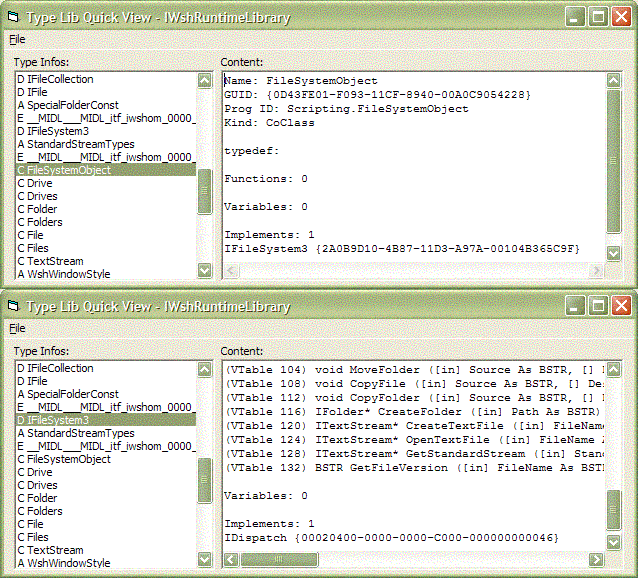



## type library browser

### Description

We all know VB`s lovely object browser.

Just select a library and view its types and their members.

But - how can VB get that names?

There were several attempts, but they all used the same lib the VB IDE uses (at least I think it does) - TLBINF32.dll.

This is an experiment on how to do it without this lib.

The trick is: a COM DLL has a type library stored in it.

The API oleaut32.LoadTypeLib() lets you load it and returns an ITypeLib interface to you.

From that point you just have to know the functions ITypeLib and ITypeInfo offer, the rest is frippery ;)

This class can handle functions, their parameters, enums, udts, coclasses and aliases. But its only an experiment and for learning purposes, not meant to be a fully working type library browser.
 
### More Info
 

             |
---                |---
**Submitted On**   |2005-10-10 14:10:02
**By**             |[Arne Elster](https://github.com/Planet-Source-Code/PSCIndex/blob/master/ByAuthor/arne-elster.md)
**Level**          |Advanced
**User Rating**    |5.0 (80 globes from 16 users)
**Compatibility**  |VB 6\.0
**Category**       |[OLE/ COM/ DCOM/ Active\-X](https://github.com/Planet-Source-Code/PSCIndex/blob/master/ByCategory/ole-com-dcom-active-x__1-29.md)
**World**          |[Visual Basic](https://github.com/Planet-Source-Code/PSCIndex/blob/master/ByWorld/visual-basic.md)
**Archive File**   |[type\_libra19392210102005\.zip](https://github.com/Planet-Source-Code/arne-elster-type-library-browser__1-62844/archive/master.zip)

